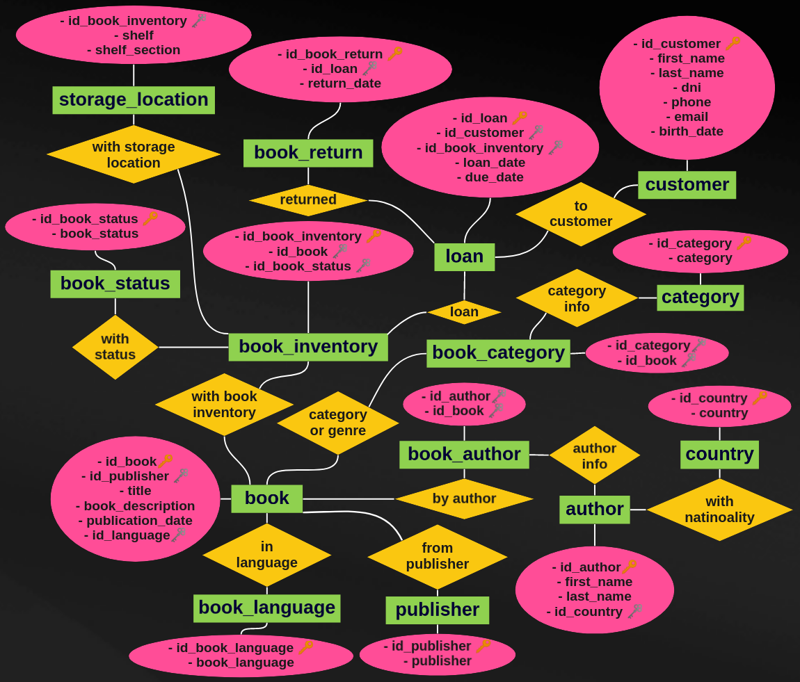

# Library SQL Database

A library database made in MySQL with books stock, authors, customers and loans. 

SQL project for [Coderhouse](https://www.coderhouse.com/online/sql).

## Entity–relationship diagram

🔑: Primary Key

🗝: Foreign Key

## Data Structure

Just run the [tables creation script](library_tables_creation.sql).

### Country table

Match id_country with country name.

| Column            | Type                                      | Description                         |
| ----------------- | :---------------------------------------- | :---------------------------------- |
| id_country        | tinyint unsigned NOT NULL AUTO_INCREMENT  | Primary Key for a Country           |
| country           | varchar(30) NOT NULL                      | Country name                        |

### Category table

Match id_category with category name.

| Column            | Type                                      | Description                         |
| ----------------- | :--------------------------               | :---------------------------------- |
| id_category       | tinyint unsigned NOT NULL AUTO_INCREMENT  | Primary Key for a category          |
| category          | varchar(30) NOT NULL                      | Category name                       |

### Publisher table

Match id_publisher with publisher name.

| Column            | Type                                      | Description                         |
| ----------------- | :--------------------------               | :---------------------------------- |
| id_publisher      | smallint unsigned NOT NULL AUTO_INCREMENT | Primary Key for a publisher         |
| publisher         | varchar(30) NOT NULL                      | Publisher name                      |

### Book language table

Match id_book_language with language name.

| Column            | Type                                      | Description                         |
| ----------------- | :--------------------------               | :---------------------------------- |
| id_book_language  | smallint unsigned NOT NULL AUTO_INCREMENT | Primary Key for a language          |
| book_language     | varchar(30) NOT NULL                      | Book language name                  |

### Book status table

Match id_book_status with book status. Book status can be borrowed, lost, destroyed, etc.

| Column            | Type                                      | Description                         |
| ----------------- | :--------------------------               | :---------------------------------- |
| id_book_status    | tinyint unsigned NOT NULL AUTO_INCREMENT  | Primary Key for a book status       |
| book_status       | varchar(30) NOT NULL                      | Book status name                    |

### Customer table

Library customers info.

| Column            | Type                                      | Description                         |
| ----------------- | :---------------------------------------- | :---------------------------------- |
| id_customer       | smallint unsigned NOT NULL AUTO_INCREMENT | Primary Key for a customer          |
| first_name        | varchar(30) NOT NULL                      | Customer first name                 |
| last_name         | varchar(30) NOT NULL                      | Customer last name                  |
| dni               | int unsigned NOT NULL                     | Customer DNI                        |
| phone             | varchar(20) NOT NULL                      | Customer phone number               |
| email             | varchar(50) NOT NULL                      | Customer email                      |
| birth_date        | date NOT NULL                             | Customer birth date                 |

### Book table

Book info.

| Column            | Type                                      | Description                         |
| ----------------- | :---------------------------------------- | :---------------------------------- |
| id_book           | smallint unsigned NOT NULL AUTO_INCREMENT | Primary Key for a book              |
| id_publisher      | smallint unsigned NOT NULL                | Foreign Key to publisher table      |
| title             | varchar(128) NOT NULL                     | Book title                          |
| book_description  | text NULL                                 | Book description                    |
| publication_date  | date NULL                                 | Book publication date               |
| id_book_language       | smallint unsigned NOT NULL                | Foreign Key to book_language table  |

### Book inventory table

Match book copies with id_book from book table and its status from book_status table.

| Column            | Type                                      | Description                         |
| ----------------- | :---------------------------------------- | :---------------------------------- |
| id_book_inventory | smallint unsigned NOT NULL AUTO_INCREMENT | Primary Key for a book copy         |
| id_book           | smallint unsigned NOT NULL                | Foreign Key to book table           |
| id_book_status    | tinyint unsigned NOT NULL                 | Foreign Key to book status table    |

### Storage location table

Book copies storage location. With id_book_inventory (from book_inventory table), shows its shelf number and shelf_section number.

| Column            | Type                                      | Description                         |
| ----------------- | :---------------------------------------- | :---------------------------------- |
| id_book_inventory | smallint unsigned NOT NULL                | Foreign Key to book inventory table |
| shelf             | tinyint unsigned NOT NULL                 | Shelf number                        |
| shelf_section     | tinyint unsigned NOT NULL                 | Shelf section number                |

### Loan table

Describes library loans.

| Column            | Type                                      | Description                         |
| ----------------- | :---------------------------------------- | :---------------------------------- |
| id_loan           | int unsigned NOT NULL AUTO_INCREMENT      | Primary Key for a loan              |
| id_customer       | smallint unsigned NOT NULL                | Foreign Key to customer table       |
| id_book_inventory | smallint unsigned NOT NULL                | Foreign Key to book inventory table |
| loan_date         | datetime NOT NULL                         | Loan date time                      |
| due_date          | datetime NOT NULL                         | Loan due date time                  |

### Author table

Book authors info.

| Column            | Type                                      | Description                         |
| ----------------- | :---------------------------------------- | :---------------------------------- |
| id_author         | smallint unsigned NOT NULL AUTO_INCREMENT | Primary Key for an author           |
| first_name        | varchar(30) NOT NULL                      | Author's first name                 |
| last_name         | varchar(30) NOT NULL                      | Author's last name                  |
| id_country        | tinyint unsigned NOT NULL                 | Foreign Key to country table        |

### Book author table

Books by author. Match id_author from author table with id_book from book table.

| Column            | Type                                      | Description                         |
| ----------------- | :---------------------------------------- | :---------------------------------- |
| id_author         | smallint unsigned NOT NULL                | Foreign Key to author table         |
| id_book           | smallint unsigned NOT NULL                | Foreign Key to book table           |

### Book category table

Books by category. Match id_category from category table with id_book from book table.

| Column            | Type                                      | Description                         |
| ----------------- | :---------------------------------------- | :---------------------------------- |
| id_category       | tinyint unsigned NOT NULL                 | Foreign Key to category table       |
| id_book           | smallint unsigned NOT NULL                | Foreign Key to book table           |

### Book return table

Books returns. Describes loans (from loan table) returned.

| Column            | Type                                      | Description                         |
| ----------------- | :---------------------------------------- | :---------------------------------- |
| id_book_return    | int unsigned NOT NULL AUTO_INCREMENT      | Primary Key for a book return       |
| id_loan           | int unsigned NOT NULL                     | Foreign Key to loan table           |
| return_date       | datetime NOT NULL                         | Loan return date time               |

## Views

Just run [views_creation](views_creation.sql)

## Data entry script

Just run [data_entry_script.sql](data_entry_script.sql) for an example of data entry.

Fake data from [Mockaroo](https://mockaroo.com/):

- Book titles are actually movie titles.
- Books description are sentences chosen randomly from lorem ipsum.

## Views Structure

Just run [views.sql](views.sql) for an example of views.

### Book info view

Show books info order by id_book.

| Column            | Description                         |
| ----------------- | :---------------------------------- |
| id_book           | Book id                             |
| title             | Book title                          |
| book_description  | Book description                    |
| publication_date  | Publication date                    |
| publisher         | Publisher                           |
| book_language     | Book language                       |

### Author info view

Show authors info order by id_author.

| Column            | Description                         |
| ----------------- | :---------------------------------- |
| id_author         | Author id                           |
| complete_name     | Author complete name                |
| nationality       | Author nationality                  |

### Lost books view

Show lost books order by id_book.

| Column            | Description                         |
| ----------------- | :---------------------------------- |
| id_book_inventory | Book inventory id                   |
| id_book           | Book id                             |
| title             | Book title                          |

### Loans by book view

Show loans by book order by times_borrowed.

| Column            | Description                         |
| ----------------- | :---------------------------------- |
| id_book           | Book id                             |
| title             | Book title                          |
| times_borrowed    | Times borrowed                      |

### Overdue loans view

Show overdue loans order by due date.

| Column            | Description                         |
| ----------------- | :---------------------------------- |
| id_loan           | Loan id                             |
| id_book_inventory | Book inventory id                   |
| title             | Book title                          |
| id_customer       | Customer id                         |
| customer          | Customer complete name              |
| phone             | Customer phone                      |
| email             | Customer email                      |
| due_date          | Due date                            |

### Borrowed books view

Show borrowed books order by expected return.

| Column            | Description                         |
| ----------------- | :---------------------------------- |
| id_book_inventory | Book inventory id                   |
| id_book           | Book id                             |
| title             | Book title                          |
| loan_date         | Loan date                           |
| expected_return   | Due date                            |

### Available books view

Show available books and its quantity in stock order by id_book.

| Column            | Description                         |
| ----------------- | :---------------------------------- |
| id_book           | Book id                             |
| title             | Book title                          |
| quantity_in_stock | Quantity in stock                   |

## Functions

In [functions.sql](functions.sql):
- get_available_stock_book
- get_book_times_borrowed